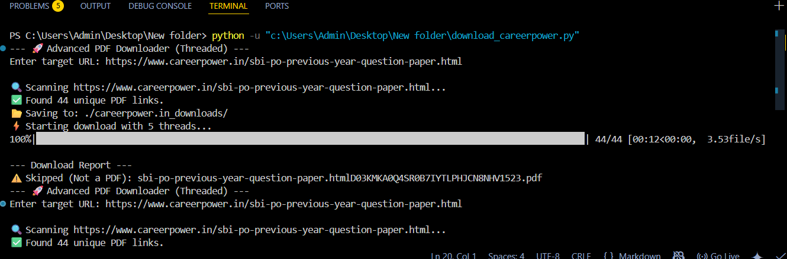

# 🚀 Advanced Bulk PDF Downloader

A robust, multithreaded Python command-line tool designed to scrape websites and bulk download PDF documents. Initially built to help a student quickly gather previous year's exam question papers, saving hours of manual clicking.


*(Note: Replace this image with an actual screenshot of your terminal running the script if you want)*

## 🌟 Features

It's not just a basic loop. This tool includes advanced features for reliability and speed:

* **⚡ Multithreaded Downloads:** Uses `concurrent.futures` to download 5 files simultaneously, significantly speeding up the process.
* **📊 Visual Progress Bar:** Integrates `tqdm` for real-time feedback on download status and ETA.
* **🛡️ Robust Error Handling:** Implements automatic retries with exponential backoff using `requests.adapters` to handle network blips gracefully.
* **🔄 Smart Resume Capability:** Checks if a file already exists locally to avoid redownloading, saving bandwidth and time.
* **🧠 Intelligent Parsing:** Scans for links ending in `.pdf` AND links where the anchor text contains "PDF" (useful for hidden download links).
* **📂 Auto-Organization:** Automatically creates a new folder based on the website domain domain to store files.

## 🛠️ Tech Stack

* **Python 3.x**
* **`requests` & `BeautifulSoup4`**: For HTML fetching and parsing.
* **`concurrent.futures` (ThreadPoolExecutor)**: For parallel execution.
* **`tqdm`**: For terminal progress bars.
* **`urllib3`**: For retry logic.

## 📋 Installation

1.  Clone this repository:
    ```bash
    git clone https://github.com/Xzen123/pdf_scrapper_v01.git
    ```
2.  Navigate to the folder:
    ```bash
    cd [YOUR FOLDER NAME]
    ```
3.  Install the required dependencies:
    ```bash
    pip install requests beautifulsoup4 tqdm urllib3
    ```

## 🚀 Usage

1.  Run the script:
    ```bash
    python pdfscrappertool.py
    ```
2.  When prompted, paste the URL of the page containing the PDF links.
3.  Watch it fly! ⚡

The script will create a folder in the same directory named after the website domain (e.g., `careerpower_downloads`) and save all discovered PDFs there.

## ⚠️ Disclaimer

This tool is for educational purposes and personal use. Please respect the `robots.txt` file of websites and do not overwhelm servers with excessive requests.
